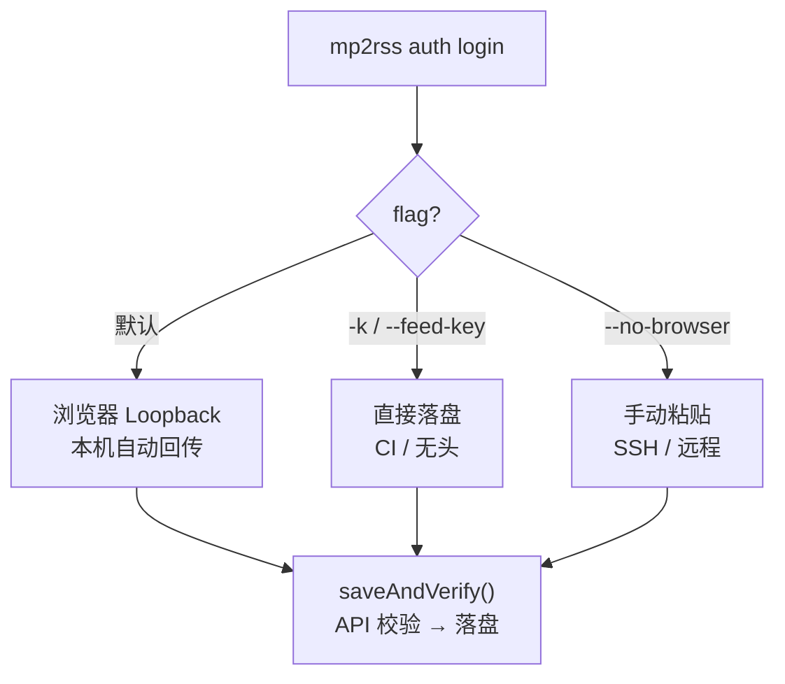
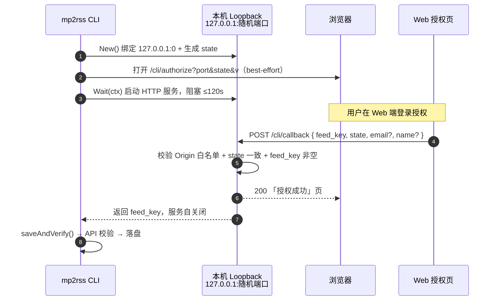
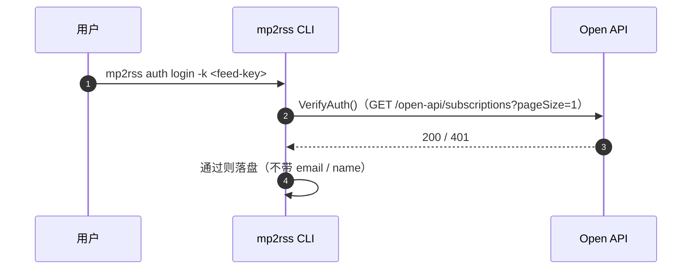
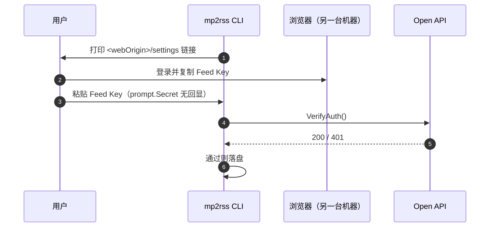

# mp2rss CLI 授权流程

`mp2rss auth` 模块负责登录、登出与状态查询。三种登录方式最终都收口到
`saveAndVerify()`——**先打 API 校验 Feed Key，通过才落盘**。

> 代码：命令层 `cmd/auth/`，Loopback 授权流 `internal/authflow/`，
> 凭据存储 `internal/config/`，API 校验 `internal/client/`。

## 核心概念

| 概念 | 说明 |
| --- | --- |
| **Feed Key** | 用户访问凭据，等价 API Token；请求以 `Authorization: Bearer <feedKey>` 携带。敏感凭据，绝不回显。 |
| **Web Origin** | 授权页 `/cli/authorize` 来源，默认 `https://mp2rss.bugcode.dev`，隐藏 flag `--web-origin` 可覆盖。 |
| **state** | 32 字节随机 hex（`crypto/rand`）的一次性 CSRF nonce。 |
| **配置文件** | `~/.mp2rss/config.json`，目录 `0700` / 文件 `0600`。 |

## 三种登录方式总览



### 方式一：浏览器 OAuth Loopback（默认）



超时（120s 未回调）报错并提示改用 `-k` 或 `--no-browser`。

### 方式二：直接落盘 `-k / --feed-key`



适合 CI / 无头环境：跳过浏览器与回环服务，直接校验落盘。

### 方式三：手动粘贴 `--no-browser`



适合 SSH / 远程终端（回环端口不可达）。空输入以参数错误（退出码 2）退出。

## 配置优先级

```
命令行 flag  >  环境变量  >  配置文件  >  内置默认
```

| 维度 | flag | 环境变量 | 配置文件 | 默认 |
| --- | --- | --- | --- | --- |
| Feed Key | `--api-key` | `MP2RSS_FEED_KEY` | `feed_key` | （无） |
| API URL | `--api-url` | `MP2RSS_API_URL` | `api_url` | `https://mp2rss.bugcode.dev` |

## 安全设计

- 只监听 `127.0.0.1`，单一路由 `/cli/callback`（POST）。
- Origin 白名单：生产域名 + `http://localhost:3000` + `http://[::1]:3000` + 运行期 `--web-origin`。
- `state` nonce 防 CSRF；不一致即失败。
- Feed Key 永不回显；`ReadHeaderTimeout=5s`、整体 `120s` 超时；首次回调后服务自关闭。
- 配置目录 `0700` / 文件 `0600`，每次 `Save()` 重新收紧权限。

## 命令与退出码

| 命令 | 说明 |
| --- | --- |
| `auth login` | 登录，flag：`-k/--feed-key`、`--no-browser`、`--web-origin`（隐藏）。 |
| `auth status` | 状态、API 地址、Feed Key 掩码、`source`（env/config/none）；`-o json` 时间戳为毫秒。 |
| `auth logout` | 清除 Feed Key 与身份，保留 `api_url`。 |

| 码 | 含义 | 授权场景 |
| --- | --- | --- |
| `0` | 成功 | 登录 / 登出成功 |
| `1` | 通用错误 | 绑定端口失败、写配置失败 |
| `2` | 参数错误 | `--no-browser` 下未提供 Feed Key |
| `3` | 未认证 | 校验返回 401 |
| `5` | 上游不可用 | 校验时网络错误 / 5xx |

## 相关文档

- [安装指南](./agent-install.md)
- [CLI 命令参考](https://areyoubugcoder.github.io/Mp2RSS/cli/commands.html)
</content>
